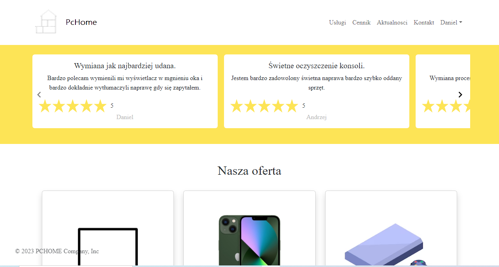
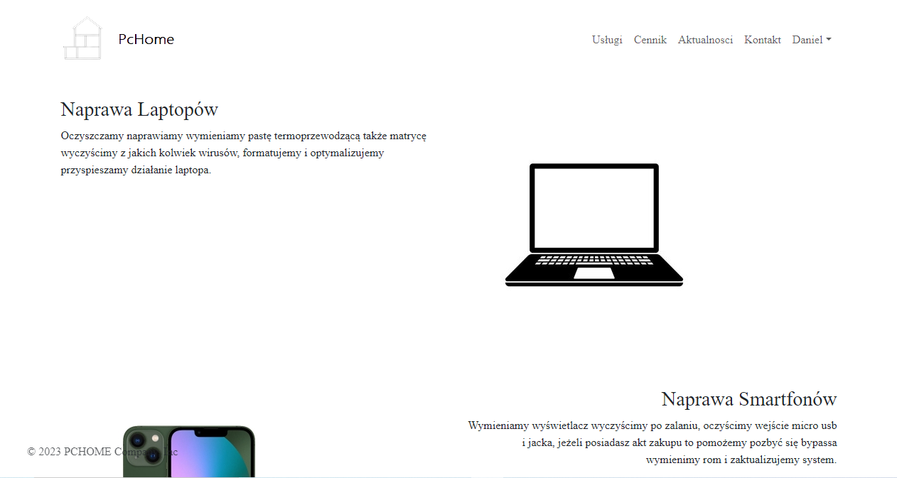
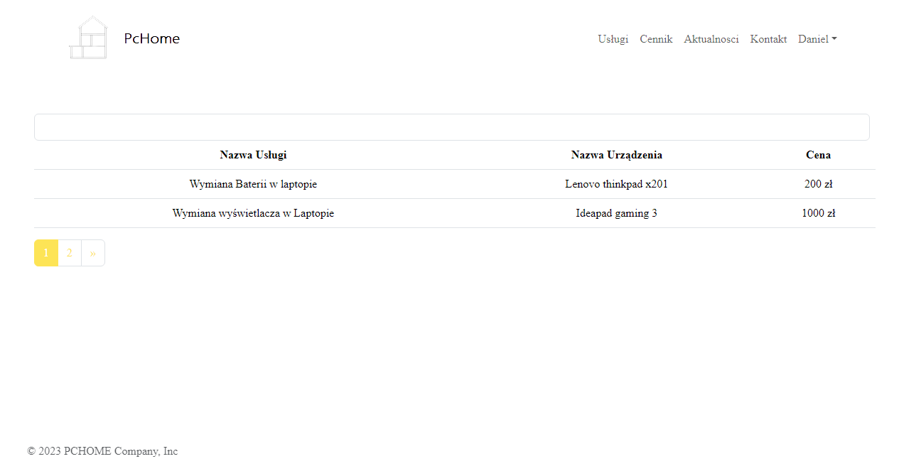
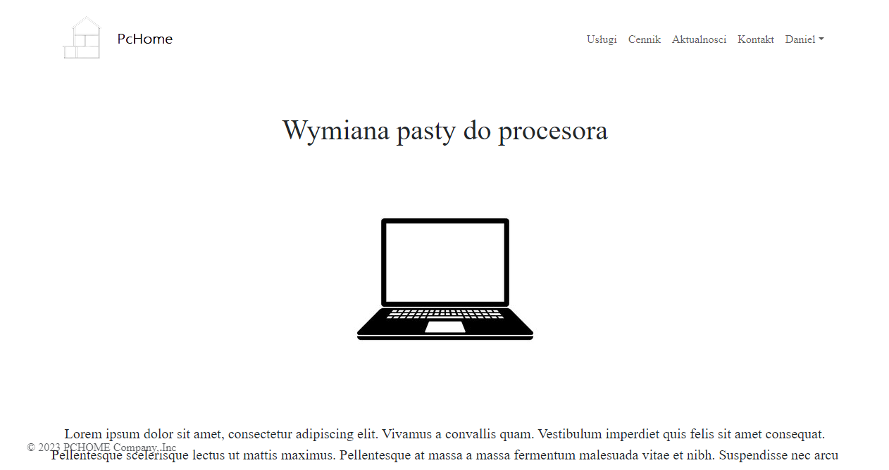
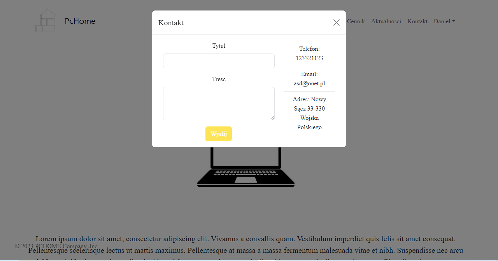
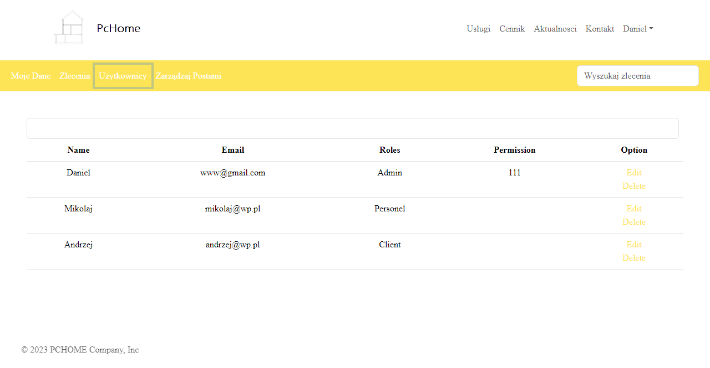
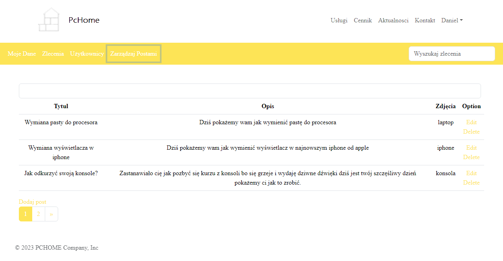

Permission/Role Command:
Object('search date') only has_table/onetable
Object('') all_table
Object->Permission(has_table)
Object->Permission(all_table)
Object->Permission(one_table_role,one_table_user)
Object->Role(has_table)
Object->Role(all_table)
Object->Role(one_table_role,one_table_user)
Object->User(has_table)
Object->User(all_table)
Object->User(one_table_role,one_table_user)

