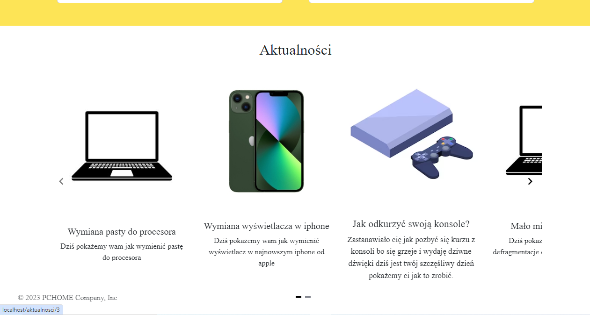
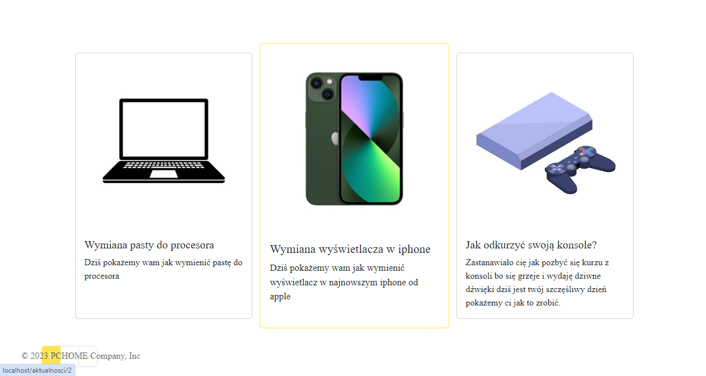

Permission/Role Command:
Object->Permission(has_table)
Object->Permission(all_table)
Object->Permission(one_table)
Object->Role(has_table)
Object->Role(all_table)
Object->Role(one_table)
Object->User(has_table)
Object->User(all_table)
Object->User(one_table)

